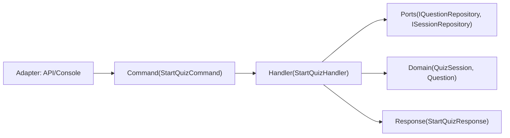


# 🚀 Application‑lagret

**Syfte:** Implementera **use cases** med mönstret **Handler–Command–Response**. Orkestrerar domänobjekt och portar (interfaces), men är helt UI‑agnostiskt.

## Översikt

- **Features/** innehåller use cases: `StartSession`, `AnswerQuestion`, `FinishSession`.
- **Interfaces/** innehåller portar: `IQuestionRepository`, `ISessionRepository`, samt tjänsteabstraktioner (`IQuestionService`, `ISessionService`).
- **Services/** kan exponera en fasad över handlers.



## Ansvar

- Validera **inparametrar** (ArgumentException/ArgumentOutOfRangeException).
- Anropa domänbeteenden och hantera flödet.
- Returnera **Response** (UI‑agnostiskt kontrakt).

## Principer

- **Ingen Console/HTTP** i Application.
- Konsekventa namn: `*Command`, `*Handler`, `*Response`.

## Exempel (kort)

```csharp
public sealed record StartQuizCommand(int QuestionCount, string? Category = null, int? Difficulty = null);
public sealed record StartQuizResponse(Guid SessionId, IReadOnlyList<Question> Questions);

public sealed class StartQuizHandler
{
    private readonly IQuestionRepository _questions;
    private readonly ISessionRepository _sessions;

    public StartQuizHandler(IQuestionRepository q, ISessionRepository s)
    { 
        _questions = q; 
        _sessions = s; 
    }

    public async Task<StartQuizResponse> HandleAsync(StartQuizCommand cmd, CancellationToken ct)
    {
        if (cmd.QuestionCount <= 0) 
            throw new ArgumentOutOfRangeException(nameof(cmd.QuestionCount));

        // Hämta rätt antal frågor
        var qs = await _questions.GetRandomAsync(cmd.Category, cmd.Difficulty, cmd.QuestionCount, ct);

        // Skapa en ny quiz session
        var session = new QuizSession 
        { 
            Id = Guid.NewGuid(), 
            StartedAtUtc = DateTime.UtcNow, 
            QuestionCount = cmd.QuestionCount 
        };

        // Spara genom sessions repository
        await _sessions.SaveAsync(session, ct);

        // Returnera ett svar
        return new StartQuizResponse(session.Id, qs);
    }
}
```

## Anti‑pattern (ska vi alltid undvika)

- Blanda in HTTP‑statuskoder eller `Console.ReadLine`.

## Testning (överkurs)

- Mocka portar (`IQuestionRepository`, `ISessionRepository`).
- Testa både lyckade flöden och fel (exceptions).

---
