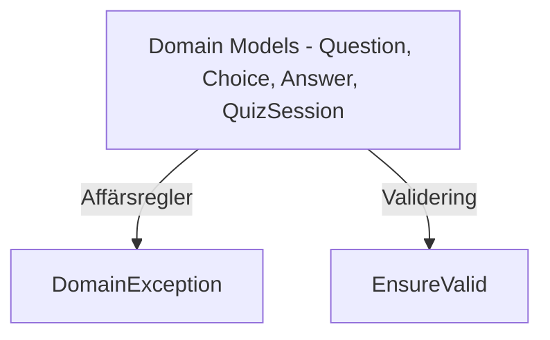

# 🧠 Domain‑lagret

**Syfte:** Hålla all affärslogik, regler, invarianter (sånt som inte förändras) och beteenden. Domain är helt omedveten om andra lager och har inga beroenden till Application, API, Console eller Infrastructure.

## Översikt

- Affärsregler och konsistens (t.ex. `QuizSession`, `Question`, `Choice`, `Answer`).
- Validering via **`EnsureValid()`** och domänspecifika undantag (`DomainException`).
- Beteende (metoder) som upprätthåller reglerna, t.ex. `SubmitAnswer(...)`, `Finish(...)`, `IsCorrect(...)`.



## Ansvar

- Definiera **invarianter** (det som alltid ska vara sant):
  - `Question` måste ha minst ett val och en giltig `CorrectAnswerCode` som finns i `Choices`.
  - `QuizSession` kan inte acceptera svar efter `FinishedAtUtc`.
  - `Answer.AnsweredAtUtc` bör vara inom sessionens tidsram.
- Kapsla **beteende** och skydda mot inkonsistens.

## Principer

- **UI‑agnostiskt**: ingen `Console`, inga HTTP‑begrepp.
- **Ingen external IO**: inga databasanrop, inga filer.
- **Tydliga fel** via `DomainException`.

## Exempel

```csharp
public class QuizSession
{
    public Guid Id { get; set; }
    public DateTime StartedAtUtc { get; set; }
    public DateTime? FinishedAtUtc { get; set; }
    public int QuestionCount { get; set; }
    public IList<Answer> Answers { get; } = new List<Answer>();

    public int Score => Answers.Count(a => a.IsCorrect);

    public void SubmitAnswer(Question question, string choiceCode, DateTime answeredAtUtc)
    {
        // Beteende + validering
    }

    public void Finish(DateTime finishedAtUtc)
    {
        // Idempotent avslut
    }
}
```

## Anti‑pattern (ska vi alltid undvika)

- Lägga `Console.WriteLine` eller HTTP‑statuskoder i Domain.
- Hoppa över `EnsureValid()` i konstruktorer/komplexa metoder.

## Testning (överkurs)

- Skriv **rena enhetstester** mot domänbeteenden.
- Testa invariants: dubbla svar, tidsordning, korrekta val.

---
